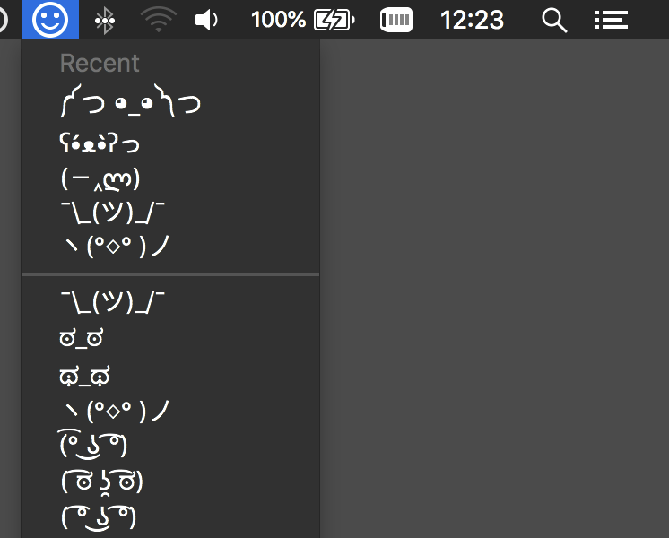

# Overview

Mac menubar app which allows quick access to horizontal smileys like this: ¯\\\_(ツ)\_/¯
When you click an entry, it's copied to the clipboard so you can paste it elsewhere.

# Missing features

* Code cleanup because there's too much in the AppDelegate
* Preference to start automatically when logging in
* Parse YAML smileys from https://github.com/leighmcculloch/looks.wtf/
* If user picked a choice that's already present in the recents menu, simply
  reorder recents instead of inserting it again at index 0

